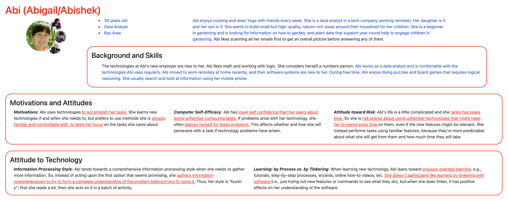
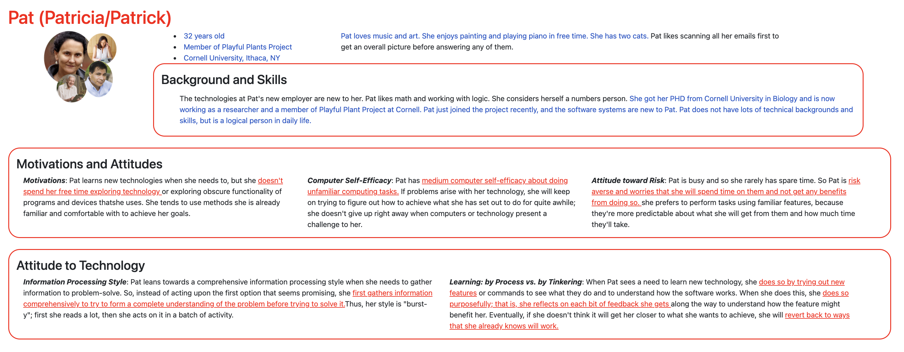

# Project 2: Design Journey

**For each milestone, complete only the sections that are labeled with that milestone.** Refine all sections before the final submission. If you later need to update your plan, **do not delete the original plan, leave it place and append your new plan below the original.** Explain why you are changing your plan. Remember you are graded on your design process. Updating the plan documents your process!

**Replace ALL _TODOs_ with your work.** (There should be no TODOs in the final submission.)

Be clear and concise in your writing. Bullets points are encouraged.

**Everything, including images, must be visible in Markdown Preview.** If it's not visible in Markdown Preview, then we won't grade it. We won't give you partial credit either. **Your design journey should be easy to read for the grader; in Markdown Preview the question _and_ answer should have a blank line between them.**


## Design / Plan (Milestone 1)

**Make the case for your decisions using concepts from class, as well as other design principles, theories, examples, and cases from outside of class (includes the design prerequisite for this course).**

You can use bullet points and lists, or full paragraphs, or a combo, whichever is appropriate. The writing should be solid draft quality.

### Audiences (Milestone 1)
> Who are your site's audiences?
> Briefly explain who the intended audiences are for your project website.
> **DO NOT INVENT RANDOM AUDIENCES HERE!** Use the audiences from the requirements.

_Consumer_: parents with developing children who are interested in building small but high quality, nature-rich areas around their households

_Site Administrator_: members of the Playful Plants Project who are researchers at Cornell University


### _Consumer_ Audience Goals (Milestone 1)
> Document your audience's goals.
> List each goal below. There is no specific number of goals required for this, but you need enough to do the job.
> **DO NOT INVENT RANDOM GOALS HERE OR STEREOTYPE HERE!** Your goals are things that your users want accomplish when using the site (e.g. print a list of plants). These are informed by the Playful Plants objectives. Review the assignment's requirements for details.

_Consumer_ Goal 1: View and browse potential plants at once with intuitive pictures

- **Design Ideas and Choices** _How will you meet those goals in your design?_
  - Display plants on one page with minimum information but just colloquial names and the corresponding pictures
- **Rationale & Additional Notes** _Justify your decisions; additional notes._
  - Since parents of developing children are no experts in plants or biology-related knowledge, name and pictures of plants are the most intuitive and relevant information for them to have a first glance of potential plants.
  - With potential plants on the same page, consumers will have a basic glimpse, understanding, and first impressionce of choices

_Consumer_ Goal 2: Identify nature-rich plants that will provide interests or help to engage children in gardening

- **Design Ideas and Choices** _How will you meet those goals in your design?_
  - Display information regarding whether the plant is nature-rich and could provide interests or help, such as the general type of plant (shrub, grass, vine, etc.), and the play oppotunities each plant offer
  - Use tags to show plant characteristics
- **Rationale & Additional Notes** _Justify your decisions; additional notes._
  - Play opportunities of each plant is relevant and useful information for consumers to decide what plant is nature-rich and could provide year-long help to engage children, as playfulness is attractive to children
  - The general type of plant is also relevant and is useful in identifying whether a plant is nature-rich
  - Tags are straightforward and intuitive for consumers to look at and identify whether a plant has certain characteristics, which can be helpful in selecting nature-rich ones

_Consumer_ Goal 3: Identify whether a plant is year-round
- **Design Ideas and Choices** _How will you meet those goals in your design?_
  - Display information regarding  whether a plant is an annual or perennial
- **Rationale & Additional Notes** _Justify your decisions; additional notes._
  - Information about whether a plant is annual or perennial inform the consumers whether each supports year-long interest and help that is suitable for them to garden

_Consumer_ Goal 4: Learn about basic plant care information that can be applied to gardening

- **Design Ideas and Choices** _How will you meet those goals in your design?_
  - Display information of growing needs and characteristics of each plant, such as the hardiness zone, and the sun requirements
- **Rationale & Additional Notes** _Justify your decisions; additional notes._
  - Since the consumers plan to garden using the plant data, information about plants' hardiness zoon and sun requirements are essential to learn about

_Consumer_Goal 5: Select plants of specific type

- **Design Ideas and Choices** _How will you meet those goals in your design?_
  - The database will support filtering and sorting plants simultaneously, allowing multiple possible combinations of plant data
- **Rationale & Additional Notes** _Justify your decisions; additional notes._
  - With filtering and sorting, the consumer will be able to locate down to plants that satisfy their specific requirements and ones that are the most suitable in supporting gardening and engaging children

### _Consumer_ Persona (Milestone 1)
> Use the goals you identified above to develop a persona of your site's audience.
> Create your persona using GenderMag's customizable personas.
> Take a screenshot and include it here. Persona must be visible in Markdown Preview; do not use PDF format!




### _Administrator_ Audience Goals (Milestone 1)
> Document your audience's goals.
> List each goal below. There is no specific number of goals required for this, but you need enough to do the job.
> **DO NOT INVENT RANDOM GOALS HERE OR STEREOTYPE HERE!** Your goals are things that your users want accomplish when using the site (e.g. print a list of plants). These are informed by the Playful Plants objectives. Review the assignment's requirements for details.

_Administrator_ Goal 1: Develop a database of playful plants, which support a range of nature play experiences, that can be view at once

- **Design Ideas and Choices** _How will you meet those goals in your design?_
  - Display plants on one page with TOPO (Play Type Categorization), name, genus and species, and plant ID
- **Rationale & Additional Notes** _Justify your decisions; additional notes._
  - TOPO is the critical information for an administrator to show plants that support nature play experiences.
  - As a member of the project, the administrator has more professional knowledge of plants, and therefore information such as genus and species, and plant ID are useful for them to identify plants

_Administrator_Goal 2: Tailor selections to provide ideas and plant collections for specific nature spaces and gardens.

- **Design Ideas and Choices** _How will you meet those goals in your design?_
  - The database will support filtering and sorting plants simultaneously, allowing multiple possible combinations of plant data
- **Rationale & Additional Notes** _Justify your decisions; additional notes._
  - With filtering and sorting, the administrator will be able to come up with the most suitable ideas or collections of plants for a themed scenario

_Administrator_ Goal 3: Develop web resources for sharing the plant information

- **Design Ideas and Choices** _How will you meet those goals in your design?_
  - Allow printing selected plant list in an organized and presentable way
- **Rationale & Additional Notes** _Justify your decisions; additional notes._
  - Through printing, the selected plant list could be shared to a wider audience and served as future references
  - A presentable printed list with some styling is important for others to view and comprehend

_Administrator_ Goal 4: Allows for adding new plants into the catalog

- **Design Ideas and Choices** _How will you meet those goals in your design?_
  - Include a form that allow administrators to add new plant into the catalog
- **Rationale & Additional Notes** _Justify your decisions; additional notes._
  - Since the researchers are constantly doing research and updating information, they will have new plants to add into the database for themselves and for consumers, so an add-entry form is necessary for them to do so


### _Administrator_ Persona (Milestone 1)
> Use the goals you identified above to develop a persona of your site's audience.
> Create your persona using GenderMag's customizable personas.
> Take a screenshot and include it here. Persona must be visible in Markdown Preview; do not use PDF format!




### Site Design (Milestone 1)
> Document your _entire_ design process. **We want to see iteration!**
> **Show us the evolution of your design from your first idea (sketch) to the final design you plan to implement (sketch).**
> **Show us how you decided what data to display to each audience.**
> **Plan your URLs for the site.**
> **Provide a brief explanation _underneath_ each design artifact (2-3 sentences).** Explain what the artifact is, how it meets the goals of your personas (**refer to your personas by name**).
>
> **Important!** Plan _all_ site requirements. Don't forget login and logout.

_Initial Designs / Design Iterations:_

TODO


_Final Design:_

TODO


### Design Pattern Explanation/Reflection (Milestone 1)
> Write a one paragraph (6-8 sentences) reflection explaining how you used design patterns for media catalogs in your site's final design.

TODO


### Cognitive Styles Explanation/Reflection (Milestone 1)
> Write a one paragraph (6-8 sentences) reflection explaining how your final design supports the cognitive styles of each persona.

_Consumer Cognitive Styles Reflection:_

TODO


_Site Administrator Cognitive Styles Reflection:_

TODO


## Implementation Plan (Milestone 1, Milestone 2, Milestone 3, Final Submission)

### Database Schema (Milestone 1)
> Describe the structure of your database. You may use words or a picture. A bulleted list is probably the simplest way to do this. Make sure you include constraints for each field.
> **Hint: You probably need a table for "entries", `tags`, `"entry"_tags`** (stores relationship between entries and tags), and a `users` tables.
> **Hint: For foreign keys, use the singular name of the table + _id.** For example: `image_id` and `tag_id` for the `image_tags` (tags for each image) table.

Table: TODO

- field1: TYPE {constraints...},
- field2...
- TODO


### Database Query Plan (Milestone 1, Milestone 2, Milestone 3, Final Submission)
> Plan _all_ of your database queries. You may use natural language, pseudocode, or SQL.

```
TODO: Plan a query
```

```
TODO: Plan another query
```

TODO: ...


### Code Planning (Milestone 1, Milestone 2, Milestone 3, Final Submission)
> Plan any PHP code you'll need here using pseudocode.
> Tip: Break this up by pages. It makes it easier to plan.

```
TODO: WRITE YOUR PSEUDOCODE HERE, between the back-tick lines.
```

```
TODO: WRITE MORE PSEUDOCODE HERE, between the back-tick lines.
```

TODO: ...


### Accessibility Audit (Final Submission)
> Tell us what issues you discovered during your accessibility audit.
> What do you do to improve the accessibility of your site?

TODO


## Reflection (Final Submission)

### Audience (Final Submission)
> Tell us how your final site meets the goals of your audiences. Be specific here. Tell us how you tailored your design, content, etc. to make your website usable for your personas.

TODO


### Additional Design Justifications (Final Submission)
> If you feel like you haven’t fully explained your design choices in the final submission, or you want to explain some functions in your site (e.g., if you feel like you make a special design choice which might not meet the final requirement), you can use the additional design justifications to justify your design choices. Remember, this is place for you to justify your design choices which you haven’t covered in the design journey. You don’t need to fill out this section if you think all design choices have been well explained in the design journey.

TODO


### Self-Reflection (Final Submission)
> Reflect on what you learned during this assignment. How have you improved from Project 2? What would you do differently next time?

TODO


> Take some time here to reflect on how much you've learned since you started this class. It's often easy to ignore our own progress. Take a moment and think about your accomplishments in this class. Hopefully you'll recognize that you've accomplished a lot and that you should be very proud of those accomplishments!

TODO


### Grading: Step-by-Step Instructions (Final Submission)
> Write step-by-step instructions for the graders.
> The project if very hard to grade if we don't understand how your site works.
> For example, you must login before you can delete.
> For each set of instructions, assume the grader is starting from /

_View all entries:_

1. TODO
2.

_View all entries for a tag:_

1. TODO
2.

_View a single entry's details:_

1. TODO
2.

_How to insert and upload a new entry:_

1. TODO
2.

_How to delete an entry:_

1. TODO
2.

_How to edit and existing entry and its tags:_

1. TODO
2.
