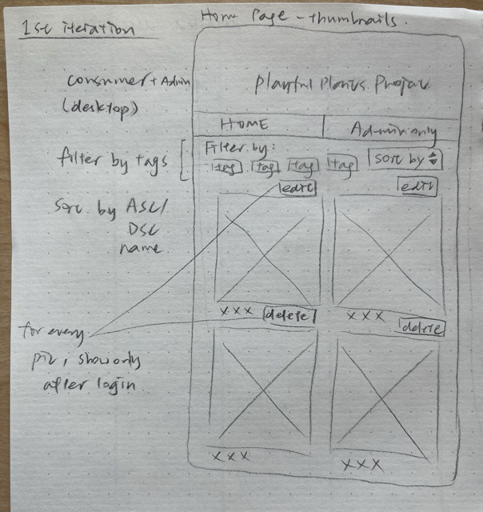
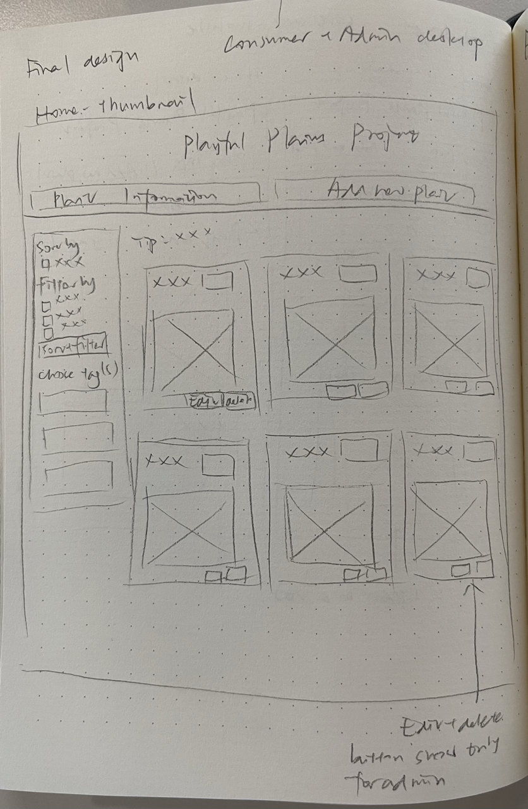
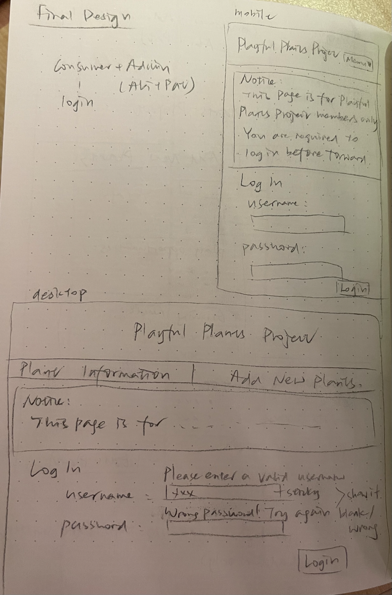

# Project 2: Design Journey

**For each milestone, complete only the sections that are labeled with that milestone.** Refine all sections before the final submission. If you later need to update your plan, **do not delete the original plan, leave it place and append your new plan below the original.** Explain why you are changing your plan. Remember you are graded on your design process. Updating the plan documents your process!

**Replace ALL _TODOs_ with your work.** (There should be no TODOs in the final submission.)

Be clear and concise in your writing. Bullets points are encouraged.

**Everything, including images, must be visible in Markdown Preview.** If it's not visible in Markdown Preview, then we won't grade it. We won't give you partial credit either. **Your design journey should be easy to read for the grader; in Markdown Preview the question _and_ answer should have a blank line between them.**


## Design / Plan (Milestone 1)

**Make the case for your decisions using concepts from class, as well as other design principles, theories, examples, and cases from outside of class (includes the design prerequisite for this course).**

You can use bullet points and lists, or full paragraphs, or a combo, whichever is appropriate. The writing should be solid draft quality.

### Audiences (Milestone 1)
> Who are your site's audiences?
> Briefly explain who the intended audiences are for your project website.
> **DO NOT INVENT RANDOM AUDIENCES HERE!** Use the audiences from the requirements.

_Consumer_: parents with developing children who are interested in building small but high quality, nature-rich areas around their households

_Site Administrator_: members of the Playful Plants Project who are researchers at Cornell University


### _Consumer_ Audience Goals (Milestone 1)
> Document your audience's goals.
> List each goal below. There is no specific number of goals required for this, but you need enough to do the job.
> **DO NOT INVENT RANDOM GOALS HERE OR STEREOTYPE HERE!** Your goals are things that your users want accomplish when using the site (e.g. print a list of plants). These are informed by the Playful Plants objectives. Review the assignment's requirements for details.

_Consumer_ Goal 1: View and browse potential plants at once with intuitive pictures

- **Design Ideas and Choices** _How will you meet those goals in your design?_
  - Display plants on one page with minimum information but just colloquial names and the corresponding pictures
- **Rationale & Additional Notes** _Justify your decisions; additional notes._
  - Since parents of developing children are no experts in plants or biology-related knowledge, name and pictures of plants are the most intuitive and relevant information for them to have a first glance of potential plants.
  - With potential plants on the same page, consumers will have a basic glimpse, understanding, and first impressionce of choices

_Consumer_ Goal 2: Identify nature-rich plants that will provide interests or help to engage children in gardening

- **Design Ideas and Choices** _How will you meet those goals in your design?_
  - Display information regarding whether the plant is nature-rich and could provide interests or help, such as the general type of plant (shrub, grass, vine, etc.), and the play oppotunities each plant offer
  - Use tags to show plant characteristics
- **Rationale & Additional Notes** _Justify your decisions; additional notes._
  - Play opportunities of each plant is relevant and useful information for consumers to decide what plant is nature-rich and could provide year-long help to engage children, as playfulness is attractive to children
  - The general type of plant is also relevant and is useful in identifying whether a plant is nature-rich
  - Tags are straightforward and intuitive for consumers to look at and identify whether a plant has certain characteristics, which can be helpful in selecting nature-rich ones

_Consumer_ Goal 3: Identify whether a plant is year-round
- **Design Ideas and Choices** _How will you meet those goals in your design?_
  - Display information regarding  whether a plant is an annual or perennial
- **Rationale & Additional Notes** _Justify your decisions; additional notes._
  - Information about whether a plant is annual or perennial inform the consumers whether each supports year-long interest and help that is suitable for them to garden

_Consumer_ Goal 4: Learn about basic plant care information that can be applied to gardening

- **Design Ideas and Choices** _How will you meet those goals in your design?_
  - Display information of growing needs and characteristics of each plant, such as the hardiness zone, and the sun requirements
- **Rationale & Additional Notes** _Justify your decisions; additional notes._
  - Since the consumers plan to garden using the plant data, information about plants' hardiness zoon and sun requirements are essential to learn about

_Consumer_Goal 5: Select plants of specific type

- **Design Ideas and Choices** _How will you meet those goals in your design?_
  - The database will support filtering and sorting plants simultaneously, allowing multiple possible combinations of plant data
- **Rationale & Additional Notes** _Justify your decisions; additional notes._
  - With filtering and sorting, the consumer will be able to locate down to plants that satisfy their specific requirements and ones that are the most suitable in supporting gardening and engaging children

### _Consumer_ Persona (Milestone 1)
> Use the goals you identified above to develop a persona of your site's audience.
> Create your persona using GenderMag's customizable personas.
> Take a screenshot and include it here. Persona must be visible in Markdown Preview; do not use PDF format!


### _Administrator_ Audience Goals (Milestone 1)
> Document your audience's goals.
> List each goal below. There is no specific number of goals required for this, but you need enough to do the job.
> **DO NOT INVENT RANDOM GOALS HERE OR STEREOTYPE HERE!** Your goals are things that your users want accomplish when using the site (e.g. print a list of plants). These are informed by the Playful Plants objectives. Review the assignment's requirements for details.

_Administrator_ Goal 1: Develop a database of playful plants, which support a range of nature play experiences, that can be view at once

- **Design Ideas and Choices** _How will you meet those goals in your design?_
  - Display plants on one page with TOPO (Play Type Categorization), name, genus and species, and plant ID
- **Rationale & Additional Notes** _Justify your decisions; additional notes._
  - TOPO is the critical information for an administrator to show plants that support nature play experiences.
  - As a member of the project, the administrator has more professional knowledge of plants, and therefore information such as genus and species, and plant ID are useful for them to identify plants

_Administrator_Goal 2: Tailor selections to provide ideas and plant collections for specific nature spaces and gardens.

- **Design Ideas and Choices** _How will you meet those goals in your design?_
  - The database will support filtering and sorting plants simultaneously, allowing multiple possible combinations of plant data
- **Rationale & Additional Notes** _Justify your decisions; additional notes._
  - With filtering and sorting, the administrator will be able to come up with the most suitable ideas or collections of plants for a themed scenario

_Administrator_ Goal 3: Develop web resources for sharing the plant information

- **Design Ideas and Choices** _How will you meet those goals in your design?_
  - Allow printing selected plant list in an organized and presentable way
- **Rationale & Additional Notes** _Justify your decisions; additional notes._
  - Through printing, the selected plant list could be shared to a wider audience and served as future references
  - A presentable printed list with some styling is important for others to view and comprehend

_Administrator_ Goal 4: Allows for adding, editing, and deleting plants into the catalog

- **Design Ideas and Choices** _How will you meet those goals in your design?_
  - Include a form that allow administrators to add new plant into the catalog
  - Allow administration to edit or delete existing data
- **Rationale & Additional Notes** _Justify your decisions; additional notes._
  - Since the researchers are constantly doing research and updating information, they will have new plants to add into the database for themselves and for consumers, so an add-entry form is necessary for them to do so
  - They may also identify mistakes in existing data or find some irrelevant or outdates, so the website will support them to edit or delete plant data on site


### _Administrator_ Persona (Milestone 1)
> Use the goals you identified above to develop a persona of your site's audience.
> Create your persona using GenderMag's customizable personas.
> Take a screenshot and include it here. Persona must be visible in Markdown Preview; do not use PDF format!


### Site Design (Milestone 1)
> Document your _entire_ design process. **We want to see iteration!**
> **Show us the evolution of your design from your first idea (sketch) to the final design you plan to implement (sketch).**
> **Show us how you decided what data to display to each audience.**
> **Plan your URLs for the site.**
> **Provide a brief explanation _underneath_ each design artifact (2-3 sentences).** Explain what the artifact is, how it meets the goals of your personas (**refer to your personas by name**).
>
> **Important!** Plan _all_ site requirements. Don't forget login and logout.

_Initial Designs / Design Iterations:_

**Iteration 1:**


This is the 1st design idea of the mobile version of Home page that both Abi and Pat will look at. I display 2 plants' pictures in a row using a thumbnail view. I decided to use a drop-down nav bar because mobile version has less space and I want to save that space for filter and sort to satisfy Abi and Pat's goal of selecting plants for themed purposes. The sketch also shows what the detailed description of each plant looks like, with colloquial name and tags on the top and the same photo of the plant as it was shown in the thumbnail, so Abi, who is risk averse and has low self-efficacy, will be able to trace what she is doing and knows whether she is looking at the right plant she wants.



This is the 1st desktop version of Home page for both Abi and Pat. Pat will be able to edit or delete each plant in the thumbnail after she logs in. I put only 2 pictures in a row to minimize information for Abi and a filtering and sorting section at the top so they are intuitive to use.


This is the desktop version of the detailed description page of a plant. I display data in lists so that Abi, who has a task-oriented motivation and process-oriented learning style, and is risk-averse and , can find what she is looking for exactly without confusion and many efforts.


This is the 1st design idea for both desktop and mobile for the admin-only page where it requires users to log in. A feedback message explicitly explaining what is going on will inform Abi she is not allowed to do anything further. The feedback for username and password field when they are not entered correctly will inform and guide Pat what to do.


This is the add entry form for desptop version where Pat will access. I first designed two forms becasue Abi and Pat have different goals and want to see different data, so I think it would be clear for Pat to enter data separately. I will include another catalog specifically for Pat below the forms.


This is the confirmation message that will show up after Pat successfully enter add entry. This ensures Pat she has done everything right and that her need is fulfilled.

**Iteration 2:**


I display only 1 picture in 1 row for this iteration for the mobile version. This would be more digestible for Abi who has the patience to view everything and one at a time as someone who has comprehensive information processing style.


I decided to have a section for all the filtering, sorting, and tags for the desktop version. I also change the name of each section in the nav bar to "Plant Information" and "Add new plant", as this tell Abi and Pat directly what each page is about.


I added a section telling Abi explicitly that this page is for admin-only before she tried to enter something to login. As someone who is risk-averse and has low self-efficacy, this message would prevent Abi from leaving the site directly or blaming herself.


I combined the two forms to one as it would be more convenient for Pat. The backend will handle what data goes to where, and the website wil also provide feedback when Pat do something wrong. As someone who is somewhere between tinkering and by process in terms of learning style, she will find the form friendly and easy-to-use without excessive feedback.


I showed only one confirmation message for this iteration and add hyperlinks linking to the catalog or linking back to the add-entry form to better guide Pat.

**Iteration 3:**


For this iteration, I plant to use hover drop-down for menu, filter, sort, and tags. This not only save space for mobile version, but also Abi, a risk-averse consumer who processes information comprehensively, to know exactly what to do. I also decided to put two pictures of plants in a row to make the most effective use of space while displaying the right amount of information for Abi to process. As mentioned before, a list dislay for the details page for each plant is helpful for Abi, who has low self-efficacy and task-oriented motivation, to select and comprehend information.


For this iteration, I plan to use hover drop-down for filter and sort, and a sidebar for tags on the right to make effective use of space, and that Abi and Pat could select plants they desire. Three pictures of plants are displayed in a row. "Delet" buttons will only appear for Pat after she logs in, so that she could reach the goal of deleting plants.


For this iteration, I plant to use boxes to group different information so that Abi and Pat to see some organization and categorization of information. "Edit Plant" button will only appear after Pat login, so that she will be able to edit plants, as her one of her needs. Information such as genus, plant ID, and TOPO will also only be displayed for Pat after login.


**_Final Design:_**

**URL for thumbnail: /**

**URL for details page: /plant-details?id=1 (example)**


(_Edited_)
Due to time constraints, I changed my design for mobile home page a bit. I decided not to use javascript but go for a simpler design that achieve the same goal for Abi. I put the section for sort and filter, as well as filter by tags on the top of the mobile page. There will be one plant entry each row, given the narrow screen size of mobile phones.

**URL: /**



(_Edited_)
Due to time constraints, I changed my design for desktop home page a bit. I decided to put the sidebar for sorting and filtering on the left side. For a standard desktop view, there will be three plants in a row, but the site support wrapping depending on different screen sizes. For instance, if the user narrows the screen size, there will be two entries in a row.

**URL for details page: /plant-details?id=1 (example)**


(_Edited_)
Due to time constraints, I changed my design for desktop home page a bit. I will align everything in the center in a column display, so that the page does not feel empty.

**URL: /add-new-plants**



I will show a notice in a box for Abi and Pat before them attempt to login. Feedback messages and sticky values will process themselves for Pat as she tries to login. These message help Abi, who is risk-averse, and has low self-efficacy and process-oriented learn style to process information and stay on site to achieve needs.

**URL: /add-new-plants**


I segmented different sections and display them in a row to save space, and show some strcuture for Pat. The concise feedback also show the right amount of guidance to Pat, who is in the middle of all cognitive facets.
I also put the full catalog of the plants as a list with filter and sort options for Pat underneath the add-entry form. Pat can refer to the catalog and see data that is relevant to her need, including plant name, species and genus, plant ID, and types of play categorizations. She will also be able to filter and sort the plants based on themed situation and select the plants that concur her desires.

(_Note_) The edit entry form will look the same as the add-entry form, so I didn't include a sketch for the edit-entry form. But here is the URL for edit-entry form:

**URL: /plant-update?id=1 (example)**

**URL: /add-new-plants**


The confirmation message provides the right amount of information and direct Pat to corresponding pages. This informs Pat her need is satified, and offer guide to her next need to edit or add more data.


### Design Pattern Explanation/Reflection (Milestone 1)
> Write a one paragraph (6-8 sentences) reflection explaining how you used design patterns for media catalogs in your site's final design.

I included filter, sort, and tags for the catalog, which allow Abi and Pat to select the plants that meet their specific needs and wants. The filter, sort, and tag functions are all sticky so that Abi and Pat will always be able to trace back to what they have selected. For the mobile version, I mainly use hover drop-down as it saves space and also makes sense to Abi and Pat, informing what they can do. For the desktop version, I include a sidebar for tags so that it is intuitive to use. I used thumbnails to display plants so that Abi and Pat could view all plants at once. They could click on each pictures to view details of the plant. Information are also grouped together and are shown in list display, which is concise and organized to view. The website also support printing list.


### Cognitive Styles Explanation/Reflection (Milestone 1)
> Write a one paragraph (6-8 sentences) reflection explaining how your final design supports the cognitive styles of each persona.

_Consumer Cognitive Styles Reflection:_


In my final design, I used hover drop-down for filter and sort (also tag for mobile version), which support Abi, a risk-averse consumer who processes information comprehensively, to know exactly what to do. I employed a list dislay for the details page for each plant, which is helpful for Abi, who has low self-efficacy and task-oriented motivation, to select and comprehend information. I also provides a notice on the "add new plants" page to inform Abi kindly that page is not for her. I phrased the notice in a gentle and clear way so that Abi, who has low computer self-efficacy and is risk-averse, would not blame herself and leave site after trying to log in but fail. In addition, I made sure not to present too much information at once to Abi, but display them step-by-step in a reasonble sequence, so she could digest all information. As someone who tend to process information comprehensively, she would read through everything and complete her task following the site guide.

_Site Administrator Cognitive Styles Reflection:_

Since Pat falls mostly in the middle of the five cognitive style facets, I include concise information that provide the right amount of information to understand a task. For instance, I grouped different information both in the catalog and in the form so that Pat will be able to trace and locate to her desired information. I also provided feedback using concise yet gentle expressions to inform her she is doing something wrong. These design choices would guide and sufficient for Pat, who combine tinkering and processing information comprehensively. I also created a separate page for Pat to add new plants so that she will not feel overwhelmed by too much information on one page, which might stimulate risk-averse behaviors. The confirmation page also acts as an affirmation to Pat, who is somewhat risk-averse but not quite so. With the concise message, Pat would be assured and move onto the next task, or even explore new functions, given she is neither task-motivated or technology-motivated.


## Implementation Plan (Milestone 1, Milestone 2, Milestone 3, Final Submission)

### Database Schema (Milestone 1)
> Describe the structure of your database. You may use words or a picture. A bulleted list is probably the simplest way to do this. Make sure you include constraints for each field.
> **Hint: You probably need a table for "entries", `tags`, `"entry"_tags`** (stores relationship between entries and tags), and a `users` tables.
> **Hint: For foreign keys, use the singular name of the table + _id.** For example: `image_id` and `tag_id` for the `image_tags` (tags for each image) table.

Table1: entries

- id: INTEGER {PK, U, NN, AI}
- name_colloquial: TEXT {NN}
- name_genus_species: TEXT {NN}
- plant_id: TEXT {NN}
- exploratory_constructive_play: INTEGER {NN}
- exploratory_sensory_play: INTEGER {NN}
- physical_play: INTEGER {NN}
- imaginative_play: INTEGER {NN}
- restorative_play: INTEGER {NN}
- play_with_rules: INTEGER {NN}
- bio_play: INTEGER {NN}
- perennial: INTEGER {NN}
- full_sun: INTEGER {NN}
- partial_shade: INTEGER {NN}
- full_shade: INTEGER {NN}
- hardiness_zone_range: TEXT {NN}

Table2: tags

- id: INTEGER {PK, U, NN, AI}
- shrub: INTEGER {NN}
- grass: INTEGER {NN}
- vine: INTEGER {NN}
- tree: INTEGER {NN}
- flower: INTEGER {NN}
- groundcovers: INTEGER {NN}
- other: INTEGER {NN}

Table3: entry_tags

- id: INTEGER {PK, U, NN, AI}
- entry_id: INTEGER {NN}
- tag_id: INTEGER {NN}

Table4: users

- id: INTEGER {PK, U, NN, AI}
- name: TEXT {NN}
- username: TEXT {U, NN}
- password: TEXT {NN}

Table5: sessions

- id: INTEGER {PK, U, NN, AI}
- user_id: INTEGER {NN}
- session: TEXT {U, NN}
- last_login: TEXT {NN}
FOREIGN KEY(user_id) REFERENCES users(id)

Table6: groups

- id: INTEGER {PK, U, NN, AI}
- name: TEXT U, {NN}

Table7: admins

- id: INTEGER {PK, U, NN, AI}
- group_id: INTEGER {NN}
- user_id: INTEGER {NN}
FOREIGN KEY(group_id) REFERENCES groups(id),
FOREIGN KEY(user_id) REFERENCES users(id)


### Database Query Plan (Milestone 1, Milestone 2, Milestone 3, Final Submission)
> Plan _all_ of your database queries. You may use natural language, pseudocode, or SQL.

1. All Records

    ```
    SELECT
      entries.name_colloquial AS 'entries.name_colloquial',
      entries.name_genus_species AS 'entries.name_genus_species',
      entries.plant_id AS 'entries.plant_id',
      entries.exploratory_constructive_play AS 'entries.exploratory_constructive_play',
      entries.exploratory_sensory_play AS 'entries.exploratory_sensory_play',
      entries.physical_play AS 'entries.physical_play',
      entries.imaginative_play AS 'entries.imaginative_play',
      entries.restorative_play AS 'entries.restorative_play',
      entries.play_with_rules AS 'entries.play_with_rules',
      entries.bio_play AS 'entries.bio_play',
      entries.perennial AS 'entries.perennial',
      entries.full_sun AS 'entries.full_sun',
      entries.partial_shade AS 'entries.partial_shade',
      entries.full_shade AS 'entries.full_shade',
      entries.hardiness_zone_range AS 'entries.hardiness_zone_range',
      entries.img_ext AS 'entries.img_ext',
      tags.tag_name AS 'tags.tag_name',
      entry_tags.entry_id AS 'entries.id',
      entry_tags.tag_id AS 'tags.id'
    FROM
      entry_tags
      LEFT OUTER JOIN entries ON (entry_tags.entry_id = entries.id)
      LEFT OUTER JOIN tags ON (entry_tags.tag_id = tags.id);
    ```

2. Filter/Sort/Tags Records

  Filter

  ```
    SELECT * FROM entries WHERE (exploratory_constructive_play = 1);
    SELECT * FROM entries WHERE (exploratory_sensory_play = 1);
    SELECT * FROM entries WHERE (physical_play = 1);
    SELECT * FROM entries WHERE (imaginative_play = 1);
    SELECT * FROM entries WHERE (restorative_play = 1);
    SELECT * FROM entries WHERE (play_with_rules = 1);
    SELECT * FROM entries WHERE (bio_play = 1);
    SELECT * FROM entries WHERE (perennial = 1);
    SELECT * FROM entries WHERE (full_sun = 1);
    SELECT * FROM entries WHERE (partial_shade = 1);
    SELECT * FROM entries WHERE (full_shade = 1);
    SELECT * FROM entries WHERE (hardiness_zone_range = 1);
  ```

  Sort

  ```
    SELECT * FROM entries ORDER BY name_colloquial ASC;
    SELECT * FROM entries ORDER BY name_colloquial DESC;
  ```

  Tags

  ```
    SELECT * FROM entries WHERE (shrub = 1);
    SELECT * FROM entries WHERE (grass = 1);
    SELECT * FROM entries WHERE (vine = 1);
    SELECT * FROM entries WHERE (tree = 1);
    SELECT * FROM entries WHERE (flower = 1);
    SELECT * FROM entries WHERE (groundcovers = 1);
    SELECT * FROM entries WHERE (other = 1);
  ```

3. Insert Record

    ```
    INSERT INTO entries (name_colloquial, name_genus_species, plant_id, exploratory_constructive_play, exploratory_sensory_play, physical_play, imaginative_play, restorative_play, play_with_rules, bio_play) VALUES (:name_colloquial, :name_genus_species, :plant_id, :exploratory_constructive_play, :exploratory_sensory_play, :physical_play, :imaginative_play, :restorative_play, :play_with_rules, :bio_play);
    INSERT INTO entries (shrub, grass, vine, tree, flower, groundcovers, other) VALUES (:shrub, :grass, :vine, :tree, :flower, :groundcovers, :other);
    ```

### Code Planning (Milestone 1, Milestone 2, Milestone 3, Final Submission)
> Plan any PHP code you'll need here using pseudocode.
> Tip: Break this up by pages. It makes it easier to plan.

*** User log in ***
```
1. if user is not loggined in, or logged in as consumer
2.    show plant catalog with images without edit/delete button
3.    allow filtering/sorting/tagging
4.    allow access to plant detail page
5.    deny access to /add-new-plants-form
6. if user is logged in as an admin
7.    show plant catalogs with edit/delete button
8.    allow filtering/sorting/tagging
9.    allow access to plant detail page
10.   allow access to /add-new-plants-form (add form and plant catalog for admin)
```

*** "Plant Information" page_ ***

The following is the view all entry page for consumers
```
1. for every plant in $records
2.    store as $record
3.        display corresponding image
4.        display corresponding name of the plant under the image
```

The following is the view all entry page for admins
```
1. for every plant in $records
2.    store as $record
3.        display corresponding name of the plant
3.        display corresponding genus, species
4.        display corresponding plant ID
5. if there is a specific TOPO for the plant (e.g. exploratory_constructive_play)
6.     display TOPO as list
7. (repeat step 5 and 6 for all the TOPO)
```

The following is the plan for filtering/sorting form. (this form does not require user to fill out every parameter, gives a uniform feedback if the user didn't specify any filter/sort but click on the filter/sort button, and does not show a confirmation message)
```
1. initiatlize default page state (show form, hide feedback)
2. if form is submitted:
3.      store HTTP parameter (assume form is valid)
4.      check whether at least one TOPO checkbox or one sorting option is checked: if not:
5.         set form to invalid
6.         show feedback message for filtering/sorting
7. if form is valid
8.     set sticky values for the selected filtering/sorting
```

The following is the plan for selecting tags
```
1. initiatlize default page state (show form, hide feedback)
2. if at least one tag is selected:
3.         show plants that have the selected tag(s)
```

*** "Add New Plants" page_ ***

The following is the plan for user login and logout
```
1. initiatlize default page state (show form, hide feedback)
2. if form is submitted:
3.      store HTTP parameter (assume form is valid)
4.      check whether username is entered: if not:
5.         set form to invalid
6.         show feedback message for entering a username
7.      check whether password is entered: if not:
8.         set form to invalid
9.         show feedback message for entering a valid password
10. if form is valid
11.     set sticky values for the entered information
12.     direct to add-entry form
```

The following are pseudocodes for the add-entry form. (this form require the user to fill out each parameter and will show a confirmation message if form is valid)
```
1. initiatlize default page state (hide confirmation, show form, hide feedback)
2. if form is submitted:
3.      store HTTP parameter (assume form is valid)
4.      check whether plant name (colloquial parameter) is empty: if empty:
5.         set form to invalid
6.         show feedback message for plant name (colloquial) parameter
7.     check whether plant name(genus,species) parameter is empty: if empty:
8.        set form to invalid
9.        show feedback message for plant name(genus,species) parameter
10.     check whether plant id parameter is empty: if empty:
11.        set form to invalid
12.        show feedback message for plant id parameter
13.     check whether at least one TOPO checkbox is checked: if not:
14.         set form to invalid
15.         show feedback message for TOPO checkboxes
16.     check whether at least one growing need checkbox is checked: if not:
17.         set form to invalid
18.         show feedback message for growing need checkboxes
19.     check whether at least one tag is selected: if not:
20.         set form to invalid
21.         show feedback message for selecting tags
22.     check whether image of the plant is uploaded: if not:
23.         set form to invalid
24.         show feedback message for uploading image for the plant
25. if form is valid
26.     query DB
27.     show confirmation message
28. else
29.     set sticky values
```

The following is the plan for adding new plant data
```
INSERT INTO entries (name_colloquial, name_genus_species, plant_id, exploratory_constructive_play, exploratory_sensory_play, physical_play, imaginative_play, restorative_play, play_with_rules, bio_play, perennial, full_sun, partial_shade, full_shade, hardiness_zone_range, file_name, img_ext) VALUES (:name_colloquial, :name_genus_species, :plant_id, :exploratory_constructive_play, :exploratory_sensory_play, :physical_play, :imaginative_play, :restorative_play, :play_with_rules, :bio_play, :perennial, :full_sun, :partial_shade, :full_shade, :hardiness_zone_range, :file_name, :img_ext);
```

```
INSERT INTO entry_tags (entry_id, tag_id) VALUES (:entry_id, :tag_id);
```

The following is the plan for updating plant data
```
UPDATE entries SET
    name_colloquial = :name_colloquial,
    name_genus_species = :name_genus_species,
    plant_id = :plant_id,
    exploratory_constructive_play = :exploratory_constructive_play,
    exploratory_sensory_play = :exploratory_sensory_play,
    physical_play = :physical_play,
    imaginative_play = :imaginative_play,
    restorative_play = :restorative_play,
    play_with_rules = :play_with_rules,
    bio_play = :bio_play,
    perennial = :perennial,
    full_sun = :full_sun,
    partial_shade = :partial_shade,
    full_shade = :full_shade,
    hardiness_zone_range = :hardiness_zone_range
WHERE (id = $id);
```

```
UPDATE entry_tags SET
    entry_id = :entry_id,
    tag_id = :tag_id
WHERE (id = $id);
```

Assemble sql
```
if ($sort_asc) {
  $sql_query = $sql_select_part . $sql_where_part . $sql_sort_part;
}
else {
  $sql_query = $sql_select_part . $sql_where_part;
}
```

### Accessibility Audit (Final Submission)
> Tell us what issues you discovered during your accessibility audit.
> What do you do to improve the accessibility of your site?

TODO


## Reflection (Final Submission)

### Audience (Final Submission)
> Tell us how your final site meets the goals of your audiences. Be specific here. Tell us how you tailored your design, content, etc. to make your website usable for your personas.

TODO


### Additional Design Justifications (Final Submission)
> If you feel like you haven’t fully explained your design choices in the final submission, or you want to explain some functions in your site (e.g., if you feel like you make a special design choice which might not meet the final requirement), you can use the additional design justifications to justify your design choices. Remember, this is place for you to justify your design choices which you haven’t covered in the design journey. You don’t need to fill out this section if you think all design choices have been well explained in the design journey.

TODO


### Self-Reflection (Final Submission)
> Reflect on what you learned during this assignment. How have you improved from Project 2? What would you do differently next time?

TODO


> Take some time here to reflect on how much you've learned since you started this class. It's often easy to ignore our own progress. Take a moment and think about your accomplishments in this class. Hopefully you'll recognize that you've accomplished a lot and that you should be very proud of those accomplishments!

TODO


### Grading: Step-by-Step Instructions (Final Submission)
> Write step-by-step instructions for the graders.
> The project if very hard to grade if we don't understand how your site works.
> For example, you must login before you can delete.
> For each set of instructions, assume the grader is starting from /

_View all entries:_

1. the site will display all entries with photos and names for consumers when entering (Plants information page)
2. the admin will be able to view all desirable entries when clicking on the "Add New Plants" page and scrolling down

_View all entries for a tag:_

1. TODO
2.

_View a single entry's details:_

1. TODO
2.

_How to insert and upload a new entry:_

1. TODO
2.

_How to delete an entry:_

1. TODO
2.

_How to edit and existing entry and its tags:_

1. TODO
2.
